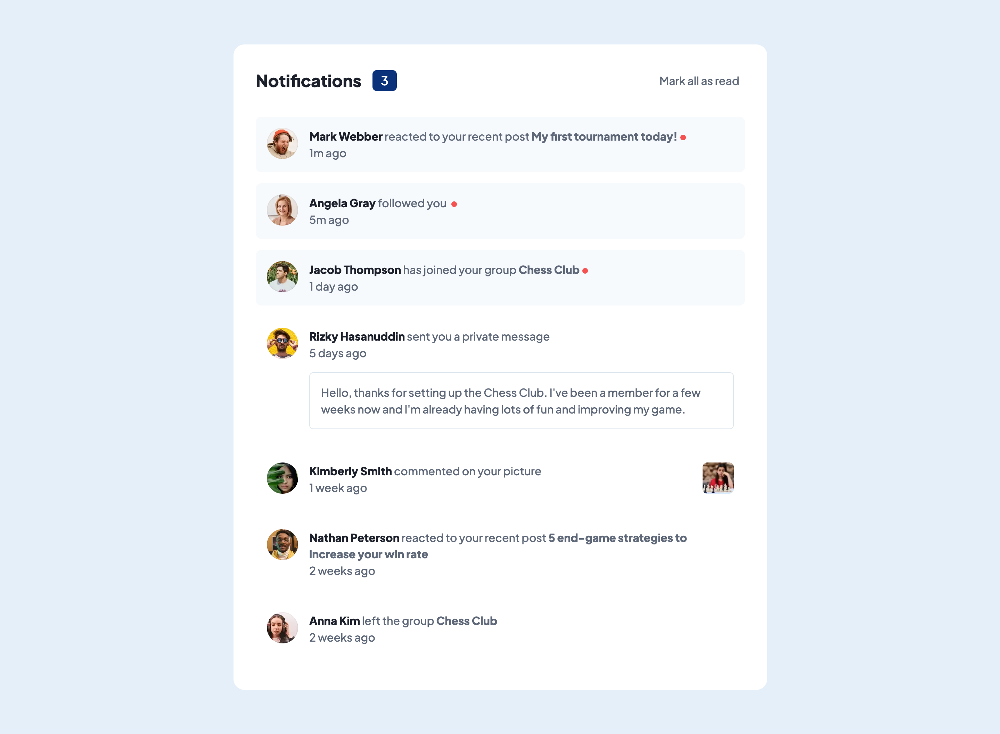

# Frontend Mentor - Notifications page solution

This is a solution to the [Notifications page challenge on Frontend Mentor](https://www.frontendmentor.io/challenges/notifications-page-DqK5QAmKbC). Frontend Mentor challenges help you improve your coding skills by building realistic projects. 

## Table of contents

- [Overview](#overview)
  - [The challenge](#the-challenge)
  - [Screenshot](#screenshot)
  - [Links](#links)
- [My process](#my-process)
  - [Built with](#built-with)
  - [What I learned](#what-i-learned)
  - [Continued development](#continued-development)
  - [Useful resources](#useful-resources)
- [Author](#author)

## Overview

### The challenge

Users should be able to:

- Distinguish between "unread" and "read" notifications
- Select "Mark all as read" to toggle the visual state of the unread notifications and set the number of unread messages to zero
- View the optimal layout for the interface depending on their device's screen size
- See hover and focus states for all interactive elements on the page

### Screenshot



### Links

- Solution URL: [View on Netlify](https://fem-notifications-page-seanhillweb.netlify.app/)
- Project URL: [View on Github](https://github.com/seanhillweb/frontend-mentor-notifications-page)

## My process

### Built with

- [React](https://reactjs.org/)
- [Next.js](https://nextjs.org/)
- [Tailwind CSS](https://tailwindcss.com/)

### What I learned

Creating a seperate file to manage feed data is a good idea to help with managing state within the application. Keeping track of the number of unread messages, and marking all messages as read, only used the code below:

```js
const data = feedData;
const [feed, setFeed] = useState(data);

// Keep track of number of unread feed items
let unreadCount = 0;
feed.forEach((item) => {
  // If any array item value "read" is set as false
  if (item.read === false) {
    unreadCount++; // Update count number
  }
});

function handleClick() {
  const updateFeed = feed.map((item) => {
    if ((item.read = true)) {
      return item; // If array item value "read" is set as true, no change
    } else {
      return {
        ...item,
        read: false, // Otherwise array item value "read" is set as false
      };
    }
  });
  setFeed(updateFeed); // Pass in new feed into state
}
```

### Useful resources

- [Array State Manipulation Example](https://react.dev/learn/updating-arrays-in-state) - This helped with my understanding of maninuplating state within complex array structures.

## Author

- Website - [Sean Hill](https://www.seanhillweb.com)
- Frontend Mentor - [@seanhillweb](https://www.frontendmentor.io/profile/seanhillweb)